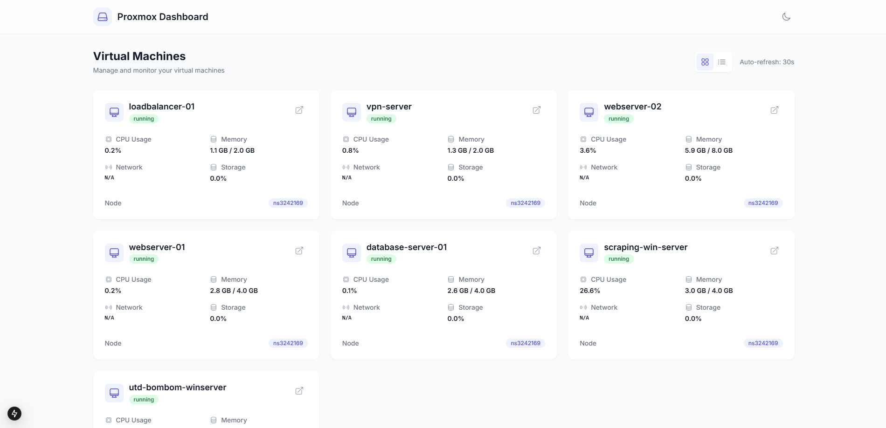
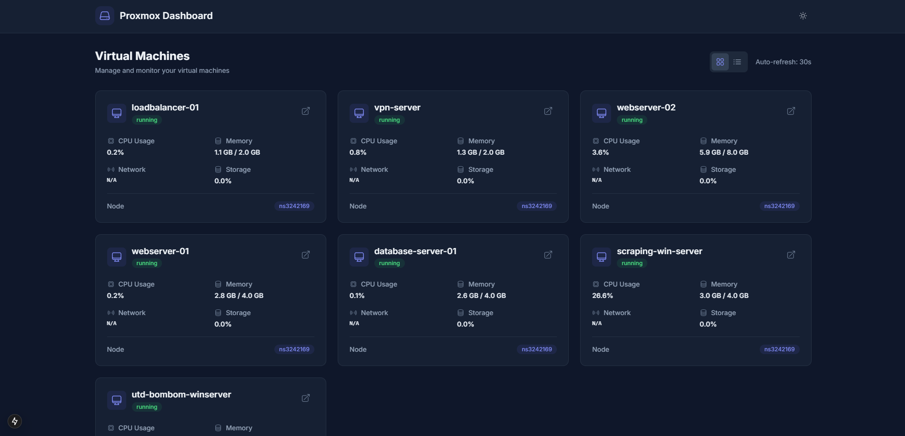

# Proxmox VM Dashboard

A modern web dashboard for managing and monitoring Proxmox virtual machines.

🌐 **Live Demo**: [https://proxmox-vm-dashboard.netlify.app/](https://proxmox-vm-dashboard.netlify.app/)

## Screenshots

### Light Theme


### Dark Theme


## Features

- 🖥️ Modern and responsive UI design
- 🌓 Light/Dark theme support
- 📊 Real-time VM statistics
- 🔄 Auto-refresh functionality
- 📱 Mobile-friendly interface
- 🔒 Secure API communication
- 🔍 Detailed VM information
- 📈 Performance monitoring
- 💾 Backup and snapshot management
- 🌐 Network statistics tracking

## Technology Stack

- Next.js 14 (App Router)
- TypeScript
- Tailwind CSS
- Heroicons
- Axios
- Docker
- Netlify

## Getting Started

1. Clone the repository:
```bash
git clone https://github.com/yourusername/proxmox-vm-dashboard.git
cd proxmox-vm-dashboard
```

2. Install dependencies:
```bash
npm install
```

3. Create `.env.local` file:
```env
PROXMOX_API_URL=https://your-proxmox-server:8006
PROXMOX_USERNAME=your-username@pam
PROXMOX_PASSWORD=your-password
```

4. Run the development server:
```bash
npm run dev
```

5. Open [http://localhost:3000](http://localhost:3000) in your browser.

## Docker Deployment

1. Build the Docker image:
```bash
docker build -t proxmox-vm-dashboard .
```

2. Run the container:
```bash
docker run -p 3000:3000 \
  -e PROXMOX_API_URL=https://your-proxmox-server:8006 \
  -e PROXMOX_USERNAME=your-username@pam \
  -e PROXMOX_PASSWORD=your-password \
  proxmox-vm-dashboard
```

## Netlify Deployment

The project is configured for easy deployment on Netlify. Simply connect your repository to Netlify and it will automatically deploy your application.

Environment variables should be configured in Netlify's dashboard under Site Settings > Build & Deploy > Environment Variables.

---

# Proxmox VM Dashboard

Proxmox sanal makinelerini yönetmek ve izlemek için modern bir web panosu.

🌐 **Canlı Demo**: [https://proxmox-vm-dashboard.netlify.app/](https://proxmox-vm-dashboard.netlify.app/)

## Ekran Görüntüleri

### Açık Tema


### Koyu Tema


## Özellikler

- 🖥️ Modern ve duyarlı kullanıcı arayüzü tasarımı
- 🌓 Açık/Koyu tema desteği
- 📊 Gerçek zamanlı VM istatistikleri
- 🔄 Otomatik yenileme işlevi
- 📱 Mobil uyumlu arayüz
- 🔒 Güvenli API iletişimi
- 🔍 Detaylı VM bilgileri
- 📈 Performans izleme
- 💾 Yedekleme ve anlık görüntü yönetimi
- 🌐 Ağ istatistikleri takibi

## Teknoloji Yığını

- Next.js 14 (App Router)
- TypeScript
- Tailwind CSS
- Heroicons
- Axios
- Docker
- Netlify

## Başlangıç

1. Depoyu klonlayın:
```bash
git clone https://github.com/yourusername/proxmox-vm-dashboard.git
cd proxmox-vm-dashboard
```

2. Bağımlılıkları yükleyin:
```bash
npm install
```

3. `.env.local` dosyası oluşturun:
```env
PROXMOX_API_URL=https://your-proxmox-server:8006
PROXMOX_USERNAME=your-username@pam
PROXMOX_PASSWORD=your-password
```

4. Geliştirme sunucusunu başlatın:
```bash
npm run dev
```

5. Tarayıcınızda [http://localhost:3000](http://localhost:3000) adresini açın.

## Docker ile Dağıtım

1. Docker imajını oluşturun:
```bash
docker build -t proxmox-vm-dashboard .
```

2. Konteyneri çalıştırın:
```bash
docker run -p 3000:3000 \
  -e PROXMOX_API_URL=https://your-proxmox-server:8006 \
  -e PROXMOX_USERNAME=your-username@pam \
  -e PROXMOX_PASSWORD=your-password \
  proxmox-vm-dashboard
```

## Netlify ile Dağıtım

Proje, Netlify üzerinde kolay dağıtım için yapılandırılmıştır. Deponuzu Netlify'a bağlamanız yeterlidir ve uygulama otomatik olarak dağıtılacaktır.

Ortam değişkenleri, Netlify kontrol panelinde Site Settings > Build & Deploy > Environment Variables altında yapılandırılmalıdır.
